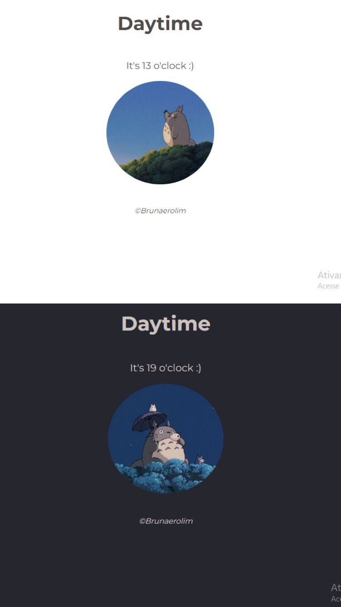

# Daytime : :clock10::

#### Project in Javascript that interacts with user's local time. 




## Como executar:

### Instale o LiveServer:

```bash
install live server
```

### Execute o projeto:

```bash
live-server
```
